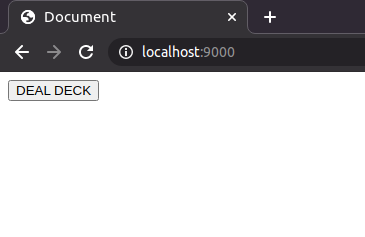
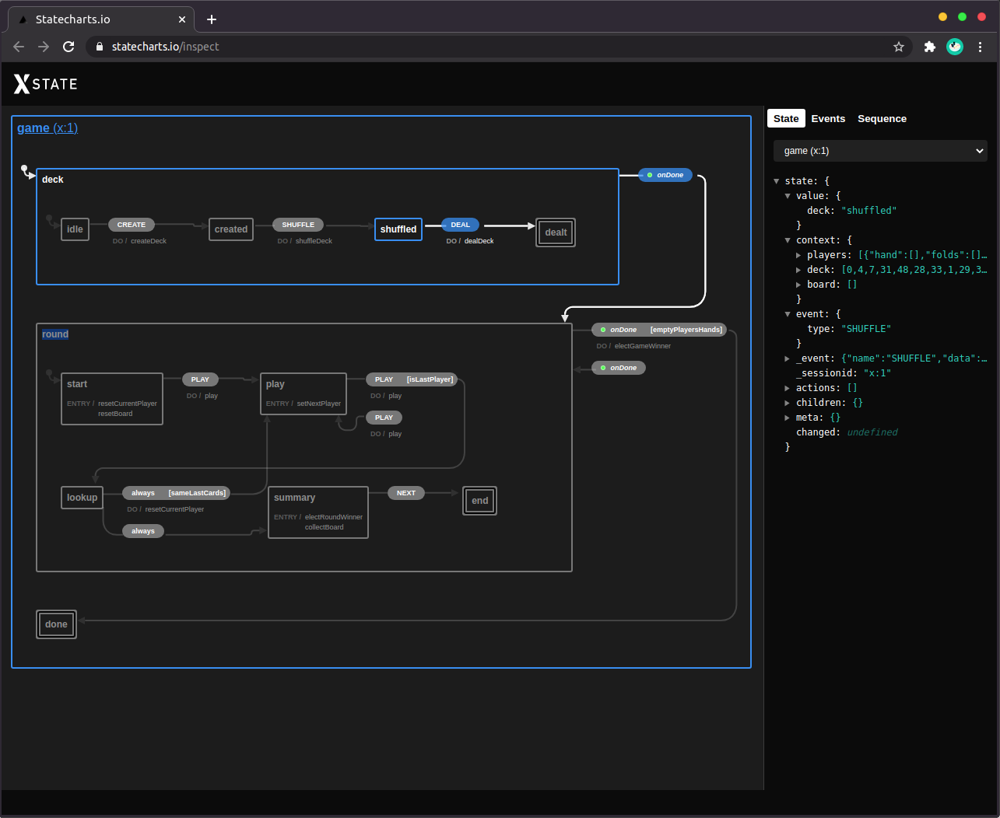

# Bataille Card Game

Game rules: https://en.wikipedia.org/wiki/War_(card_game)

Tech demo using [XState](http://xstate.js.org/) and [React](https://reactjs.org/).

The finite state machine code can be found in the [machine folder](./machine) and the react app code can be found in the [app folder](./app).

## Prerequisites

- [nodejs](https://nodejs.org/en/)
- [yarn](https://yarnpkg.com/)

## Setup

Run `yarn` in a terminal in this folder.

## Run

Run `yarn web` in a terminal in this folder.

The application is served on http://localhost:9000

The interface is quite barebone for now.

Should you care to allow popups on this page, a new tab allowing you to visualize the state machine *live* will open!

## Notes

If you're using [VS Code](https://code.visualstudio.com/) and the [remote container extension](https://code.visualstudio.com/docs/remote/containers), a dev container is available.
